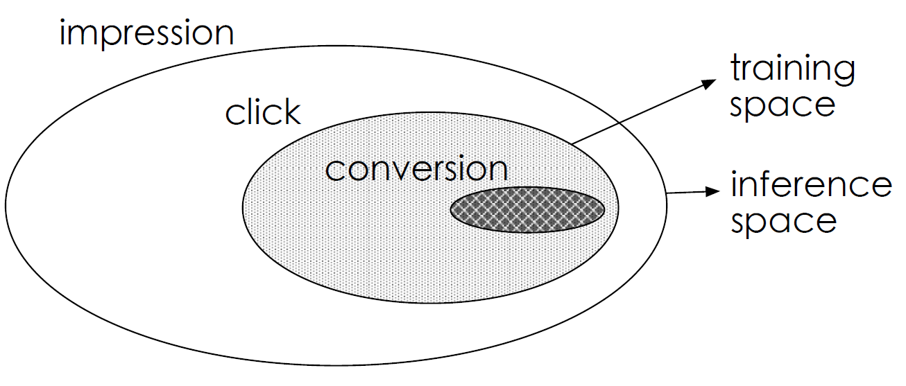

# Entire Space Multi-Task Model- An Effective Approach for Estimating Post-Click Conversion Rate
[pdf](https://arxiv.org/pdf/1804.07931.pdf)

## tags
* Alibaba 
* multi-task learning
* post-click conversion rate
* SIGIR 2018

## Highlights
1. 传统的CVR建模存在样本有偏（SSB）和数据稀疏（DS）两个问题；
1. 用两个同结构的孪生网络，分别建模CTR和CVR，共享底层的embedding来解决数据稀疏问题；
1. LOSS=LOSS\_CTR + LOSS\_CTCVR，使得CVR模型可以在全量的曝光数据上得到训练，解决样本有偏问题；
1. 在淘宝的实验数据上显示，以单独训练一个CVR模型为基线，本文的方法在CVR和CTCVR的任务都获得了2+%的AUC提升；

## Problem
1. 转化漏斗有三个阶段，曝光、点击、转化，本文集中解决如何建模点击到转化的概率；
1. 传统的解决方案，用的和CTR预估一致，圈定点击样本，训一个模型，线上使用；
1. 问题一SSB(sample selection bias)：在点击样本上训练，但预估的时候是在全部曝光样本上都需要预估的，破坏了机器学习里的IID假设；
1. 问题二DS(data sparsity)：点击样本通常比展现样本小一两个数量级，使得可以受训练的特征是洗漱的；
1. 注释：稀疏性实际上跟样本的特征空间有关系，如果是连续值输入（用户点击率、query点击率等等统计类特征），不存在所谓的样本导致的特征稀疏性问题，所以这里的稀疏性是特指对高维离散特征而言的；

## Related work
1. 对特征建立hierarchical estimators来解决DS问题，但依赖于对特征的先验知识，高维稀疏特征下不可用；
1. 负样本采样策略，将未点击样本采样为负样本，来解决SSB问题，但会严重受到采样率的影响；
1. Bid-aware的采样，容易造成数值不稳定性；
1. 所以综上，没有公开方法能完美解决SSB & DS问题；

## Approach
1. pCTCVR(clk, conv | x) = pCTR(clk | x) * pCVR(conv |clk, x)
1. 如果直接分别建模CTR和CTCVR，再相除两个预估值来代表pCVR，会有数值不稳定问题，而且无法保证pCVR是在0-1之间；
1. loss(paramCTR, paramCVR) = sum( loss(clk, f(x,paramCTR) ) + sum( loss(clk&conv, f(x, paramCTR)\*f(x, paramCVR) ) )
1. 为了解决SSB问题，用完整的曝光数集训练，loss是将CTR和CTCVR等权相加；
1. 共用了一个模型结构，所以CTR和CVR两个预估是孪生的，可以都用f来表示，不一样的只是其中的参数；
1. 为了解决DS问题，孪生网络的embedding部分是共享的，这样CTR更丰富的数据可以编码到embedding层参数中，再靠FC层来学习不同任务的特性；

## Experiments
### 实验设置
1. 从淘宝推荐日志采样了4.8亿个用户的89亿条曝光记录，成为PRODUCT集，并从中采样了8400万条作为PUBLIC集供大家复现；
1. 几个比较的方法包括：BASE=只用有点击数据训练，AMAN=从非点击中进行负样本采样，OVERSAMPLING=转化样本过采样，UNBIAS=使用pctr作bid-aware，DIVISION=独立训练CTR和CTCVR然后相除作为pCVR，ESMM-NS=孪生网络但不共享embedding层，ESMM=孪生网络且共享embedding层；
1. 公平起见，每个比较方法用同样的训练超参数，emb\_dim=18，mlp=360x200x80x2，act=relu，opt=adam(beta1=0.9, beta2=0.999, eps=1e-8)；
1. 数据按时间切分，前半截作训练集，后半截做评估集；
1. 分别比较每个方法的AUC；

### 实验结果
1. ESMM在PRODUCT集和PUBLIC集都大幅beat基准方法，有2+%的AUC提升；

## 读后记
1. loss中，等价于给(CTR, CVR, CTCVR)三个任务赋予了(1,0,1)的权重，这个权重的调整会有收益吗？
1. 网络结构的设计并没有指明辅助任务的梯度传到有向性，这里存在提升空间吗？
1. 实验评估方法确实看到了在CVR问题上的预估能力提高，但是通过CTCVR任务的表现来衡量是否解决了SSB似乎有待商榷，有没有更好的衡量办法？

## References
* [github-alibaba-全空间多任务模型(ESMM)](https://github.com/alibaba/x-deeplearning/wiki/%E5%85%A8%E7%A9%BA%E9%97%B4%E5%A4%9A%E4%BB%BB%E5%8A%A1%E6%A8%A1%E5%9E%8B(ESMM))
* [天池-数据集-Alibaba Click and Conversion Prediction](https://tianchi.aliyun.com/dataset/dataDetail?dataId=408&userId=1)
* [知乎-杨旭东-CVR预估的新思路：完整空间多任务模型](https://zhuanlan.zhihu.com/p/37562283)
* [简书-妖皇裂天-论文阅读](https://www.jianshu.com/p/07859f9228e4)
* [CSDN-Thinkgamer-【论文-完整空间多任务模型】Entire Space Multi-Task Model](https://blog.csdn.net/gamer_gyt/article/details/95014206)

## logs
* [ 2019-12-15 16:25:00 ] ends
* [ 2019-12-15 15:05:22 ] begin
