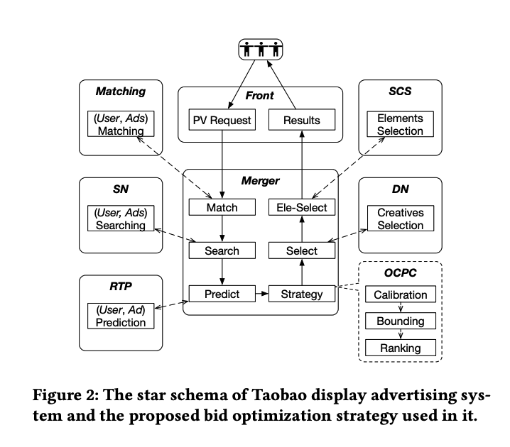

# Optimized Cost per Click in Taobao Display Advertising
[pdf](https://arxiv.org/pdf/1703.02091.pdf)

## logs
* [ 2020-01-21 16:43:11 ] begin

## tags
* Alibaba
* KDD 2017
* Display Advertising
* Bid Optimization

## Highlights

## Problem
1. 淘宝的两种广告类型
  a. 首页顶部banner位置，可以放单品、店铺或品牌；
  a. 猜你喜欢列表页里面的单品，每200个会有3个是广告位；
1. 淘宝广告系统有别于其他平台的特点：
  a. 转化全链路数据可采集；
  a. 广告主都是中小广告主，更关注短期可测量的GMV而不是影响力；
  a. CPC计费，尽管大家的投放KPI会不一样；
  a. *关注用户体验*，以CVR和GMV衡量，希望以做大盘子的方式来提高广告系统的预算容量；
1. 一般的CPC系统中，排序公式为eCPM=bid\*pctr，会造成两方面影响：
  a. 广告主对一个定向下的点击统一出价，效率有限，无法精细化的体现每个流量的具体价值；
  a. 这条公式是最大化单次请求的广告收益的，诸如GMV等用户体验的优化诉求无法体现；

## Related work
1. Facebook为代表的oCPM模式；
1. Google为代表的ECPC模式；

## Approach
### 系统架构
1. 披露了淘宝广告系统的整体架构，一个中心Merger负责串联用户画像、匹配、打分、创意优选等子服务；
1. 注释：值得注意的是，创意优选是放在排序定价阶段之后的，也就是说截至到17年，创意尚未作为重要因素加入到排序机制中来；
1. 注释：实时预估模型是MLR，尚未引入深度模型，但根据随后多篇论文的披露，实际上淘宝广告在深度模型上一路高歌猛进；

## Experiments

## References
* [谷歌的Enhanced CPC手册](https://support.google.com/google-ads/answer/2464964)
* [Facebook的oCPM手册](https://blog.adstage.io/2014/06/16/learn-about-facebook-ocpm-bidding)
